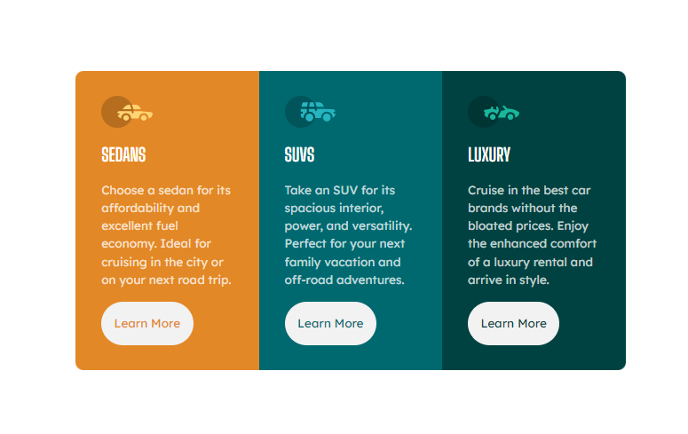

# Frontend Mentor - 3-column preview card component solution

This is a solution to the [3-column preview card component challenge on Frontend Mentor](https://www.frontendmentor.io/challenges/3column-preview-card-component-pH92eAR2-). Frontend Mentor challenges help you improve your coding skills by building realistic projects.

## Table of contents

- [Overview](#overview)
  - [The challenge](#the-challenge)
  - [Screenshot](#screenshot)
  - [Links](#links)
- [My process](#my-process)
  - [Built with](#built-with)
  - [What I learned](#what-i-learned)
  - [Useful resources](#useful-resources)
- [Author](#author)

## Overview

### The challenge

Users should be able to:

- View the optimal layout depending on their device's screen size
- See hover states for interactive elements

### Screenshot



### Links

- Solution URL: [Github Link](https://github.com/samoina/3-column-preview-card)
- Live Site URL: [Netlify Link](https://samoina-3-column-preview.netlify.app/)

## My process

### Built with

- Semantic HTML5 markup
- CSS custom properties
- Flexbox
- CSS Grid
- Mobile-first workflow

### What I learned

That I can add styling to html to center elements in the body as well as to ensure that it can stretch to accomodate content if need be. Used the [Stretching body to full viewport height: the missing way](https://dev.to/fenok/stretching-body-to-full-viewport-height-the-missing-way-2ghd) by Leonid Fenko

```css
html {
	min-height: 100%; /* Look, it's not fixed anymore! */

	display: flex;
	flex-direction: column;
}
```

### Useful resources

- [Stretching body to full viewport height: the missing way](https://dev.to/fenok/stretching-body-to-full-viewport-height-the-missing-way-2ghd) by Leonid Fenko

## Author

- Website - [Samoina Lives](https://samoinalives.wordpress.com/)
- Frontend Mentor - [Samoina](https://www.frontendmentor.io/profile/samoina)
- Twitter - [Samoina](https://www.twitter.com/samoina)
